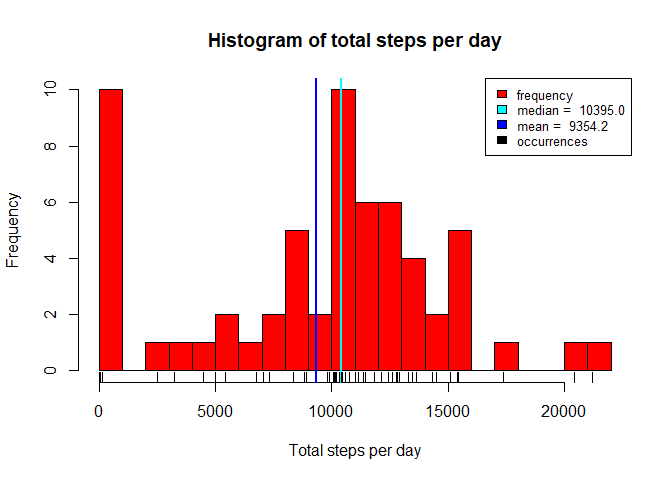

## Loading and preprocessing the data

Task description:

>Show any code that is needed to
>
>1. Load the data (i.e. read.csv())
>
>2. Process/transform the data (if necessary) into a format suitable for your analysis.

The first task is to load data into R.

The data is available in file "activity.zip" which is already in the repository.

This can be downloaded using:


```r
# if txt file and zip file are not here, attempt to download the zip file
if (!file.exists("activity.zip") && !file.exists("activity.csv")) { 
  download.file(
    "https://d396qusza40orc.cloudfront.net/repdata%2Fdata%2Factivity.zip",
    destfile = "activity.zip",mode = "wb") 
}
```

(not repeated here as it would not make sense to download the file each time).

We have unzipped the file using:


```r
# if txt file is not here but zip file is available, attempt to unzip the zip file
if(file.exists("activity.zip") && !file.exists("activity.csv")) { 
  unzip("activity.zip") 
}
```

Therefore we will have the file as "activity.csv" in the same folder as the zip file.

Let's have a look at the data:


```r
activitydata <- read.csv("activity.csv")
summary(activitydata)
```

```
##      steps                date          interval     
##  Min.   :  0.00   2012-10-01:  288   Min.   :   0.0  
##  1st Qu.:  0.00   2012-10-02:  288   1st Qu.: 588.8  
##  Median :  0.00   2012-10-03:  288   Median :1177.5  
##  Mean   : 37.38   2012-10-04:  288   Mean   :1177.5  
##  3rd Qu.: 12.00   2012-10-05:  288   3rd Qu.:1766.2  
##  Max.   :806.00   2012-10-06:  288   Max.   :2355.0  
##  NA's   :2304     (Other)   :15840
```

```r
str(activitydata)
```

```
## 'data.frame':	17568 obs. of  3 variables:
##  $ steps   : int  NA NA NA NA NA NA NA NA NA NA ...
##  $ date    : Factor w/ 61 levels "2012-10-01","2012-10-02",..: 1 1 1 1 1 1 1 1 1 1 ...
##  $ interval: int  0 5 10 15 20 25 30 35 40 45 ...
```

There is no immediate pre-processing required at this stage.

Data is available in our dataframe "activitydata".

## What is mean total number of steps taken per day?

Task description:

>For this part of the assignment, you can ignore the missing values in the dataset.
>
>1. Make a histogram of the total number of steps taken each day
>
>2. Calculate and report the mean and median total number of steps taken per day

Let's calculate the totals:


```r
totalstepsperday <- tapply(activitydata$steps, activitydata$date, sum)
summary(totalstepsperday)
```

```
##    Min. 1st Qu.  Median    Mean 3rd Qu.    Max.    NA's 
##      41    8841   10765   10766   13294   21194       8
```

```r
str(totalstepsperday)
```

```
##  int [1:61(1d)] NA 126 11352 12116 13294 15420 11015 NA 12811 9900 ...
##  - attr(*, "dimnames")=List of 1
##   ..$ : chr [1:61] "2012-10-01" "2012-10-02" "2012-10-03" "2012-10-04" ...
```

Here is the histogram:


```r
## define colors
histcolor <- "red"
meancolor <- "blue"
mediancolor <- "cyan"
rugcolor <- "black"

##define median and print it.
mdn <- median(totalstepsperday, na.rm=TRUE)
mdn
```

```
## [1] 10765
```

```r
##define mean and print it.
mn <- mean(totalstepsperday, na.rm=TRUE)
mn
```

```
## [1] 10766.19
```

```r
## add histogram
hist(totalstepsperday, breaks=20, main="Histogram of total steps per day", 
     xlab="Total steps per day", ylab="Frequency", col=histcolor)

## add median line
abline(v = mdn, col = mediancolor, lwd = 2)

## add mean line
abline(v = mn, col = meancolor, lwd = 2)

## add rug
rug(totalstepsperday, col=rugcolor)

## add legend
legend(x= "topright", c("frequency", paste("median = ",format(round(mdn,digits=1),nsmall=1)), 
    paste("mean = ",format(round(mn,digits=1),nsmall=1)), "occurrences"), cex=0.8, 
    fill=c(histcolor, mediancolor, meancolor, rugcolor))
```

<!-- -->

We note that median and mean are very similar in this case so the lines overlap in the graph.


## What is the average daily activity pattern?

Task description:

>1. Make a time series plot (i.e. type = "l") of the 5-minute interval (x-axis) and the average number of steps taken, averaged across all days (y-axis)
>
>2. Which 5-minute interval, on average across all the days in the dataset, contains the maximum number of steps?

Let's calculate the means by 5-minute interval


```r
meansperinterval <- tapply(X=activitydata$steps, INDEX=activitydata$interval, FUN=mean,
                           na.rm=TRUE )
summary(meansperinterval)
```

```
##    Min. 1st Qu.  Median    Mean 3rd Qu.    Max. 
##   0.000   2.486  34.113  37.383  52.835 206.170
```

```r
str(meansperinterval)
```

```
##  num [1:288(1d)] 1.717 0.3396 0.1321 0.1509 0.0755 ...
##  - attr(*, "dimnames")=List of 1
##   ..$ : chr [1:288] "0" "5" "10" "15" ...
```

Here is the required plot:


```r
intervals <- unlist(dimnames(meansperinterval))
plot(x=intervals, y=meansperinterval, type="l",
     main="Average steps per 5-minute interval", xlab="5-Minutes Interval (written as hmm)", 
     ylab="Average number of steps")
```

<!-- -->

This is the interval with the largest amount of steps (on average):


```r
max_steps_interval <- unlist(dimnames(meansperinterval[order(meansperinterval, decreasing=TRUE)]))[1]
max_steps_interval
```

```
## [1] "835"
```

This means the interval beginning at 08:35


## Imputing missing values


Task description:

>Note that there are a number of days/intervals where there are missing values (coded as NA). The presence of missing days may introduce bias into some calculations or summaries of the data.
>
>1. Calculate and report the total number of missing values in the dataset (i.e. the total number of rows with NAs)
>
>2. Devise a strategy for filling in all of the missing values in the dataset. The strategy does not need to be sophisticated. For example, you could use the mean/median for that day, or the mean for that 5-minute interval, etc.
>
>3. Create a new dataset that is equal to the original dataset but with the missing data filled in.
>
>4. Make a histogram of the total number of steps taken each day and Calculate and report the mean and median total number of steps taken per day. Do these values differ from the estimates from the first part of the assignment? What is the impact of imputing missing data on the estimates of the total daily number of steps?
>
The total number of rows with missing values is:

```r
sum(is.na(activitydata$steps))
```

```
## [1] 2304
```

Our choice is to select the average value in the same 5-minute interval accross all days (and truncate it to the next integer, as the steps number is always an integer).

This average is already in variable "meansperinterval" calculated previously to plot it.

The new dataframe is created first from "activitydata" then its NA values are replaced using values from "meansperinterval".

We create a new data set:

```r
fulldata <- data.frame(activitydata)
```

To replace missing values we need first to identify where they are:


```r
nasteps <- is.na(activitydata$steps)
summary(nasteps)
```

```
##    Mode   FALSE    TRUE 
## logical   15264    2304
```

```r
str(nasteps)
```

```
##  logi [1:17568] TRUE TRUE TRUE TRUE TRUE TRUE ...
```

Then we can use this index to assign these values to something else.

We can also verify that the new data frame has no missing values:


```r
fulldata$steps[nasteps] <- trunc(meansperinterval[as.character(fulldata$interval[nasteps])])
sum(is.na(fulldata))
```

```
## [1] 0
```

Making a new histogram from the data without missing values is the same process as making the first histogram - but using the different data set.


```r
fulltotalstepsperday <- tapply(fulldata$steps,fulldata$date,sum)
summary(fulltotalstepsperday)
```

```
##    Min. 1st Qu.  Median    Mean 3rd Qu.    Max. 
##      41    9819   10641   10750   12811   21194
```

```r
str(fulltotalstepsperday)
```

```
##  num [1:61(1d)] 10641 126 11352 12116 13294 ...
##  - attr(*, "dimnames")=List of 1
##   ..$ : chr [1:61] "2012-10-01" "2012-10-02" "2012-10-03" "2012-10-04" ...
```

Here is the histogram:


```r
##define median and print it.
fullmdn <- median(fulltotalstepsperday, na.rm=TRUE)
fullmdn
```

```
## [1] 10641
```

```r
##define mean and print it.
fullmn <- mean(fulltotalstepsperday, na.rm=TRUE)
fullmn
```

```
## [1] 10749.77
```

```r
## add histogram
hist(fulltotalstepsperday, breaks=20, 
    main="Histogram of total steps per day without missing values",
    xlab="Total steps per day",ylab="Frequency", col=histcolor)

## add median line
abline(v = fullmdn, col = mediancolor, lwd = 2)

## add mean line
abline(v = fullmn, col = meancolor, lwd = 2)

## add rug
rug(fulltotalstepsperday, col=rugcolor)

## add legend
legend(x= "topright", c("frequency", paste("median = ", format(round(fullmdn,digits=1),nsmall=1)),
    paste("mean = ", format(round(fullmn,digits=1),nsmall=1)), "occurrences"), cex=0.8, 
    fill=c(histcolor, mediancolor, meancolor, rugcolor))
```

<!-- -->

The difference in the median and mean is:

Median: Old value: 10765.0. New value: 10641.0. Difference: -124.0.

Mean: Old value: 10766.2. New value: 10749.8. Difference: -16.4.

We notice both the values have gone down, even if we have added more values to replace the missing values. 

This is probably due to our choice to add the truncated mean of the steps for each interval - so the days that previously had no values, now have values that are a bit lower than the averages of the same intervals in the other days. 

We can analyse a bit more where is the missing data in our dataset.


```r
natotals <- tapply(X=is.na(activitydata$steps), INDEX=activitydata$date, FUN=sum)
summary(natotals)
```

```
##    Min. 1st Qu.  Median    Mean 3rd Qu.    Max. 
##    0.00    0.00    0.00   37.77    0.00  288.00
```

```r
str(natotals)
```

```
##  int [1:61(1d)] 288 0 0 0 0 0 0 288 0 0 ...
##  - attr(*, "dimnames")=List of 1
##   ..$ : chr [1:61] "2012-10-01" "2012-10-02" "2012-10-03" "2012-10-04" ...
```

```r
hist(natotals, breaks=100, main="Histogram of count of missing values per day",
    xlab="Missing values per day", ylab="Frequency", col=histcolor)
rug(natotals)
```

<!-- -->

From the histogram I notice that most of the days have the 0 NA values and a few days seem to have many NAs.

We can see what is the sum of "is.na", which means the count of missing values, per each day in our data set. 

We find out that these values are:


```r
unique(natotals)
```

```
## 2012-10-01 2012-10-02 
##        288          0
```

and the number of days where there are missing values is:


```r
sum(natotals > 0)
```

```
## [1] 8
```

So there are only 8 days where there are 288 missing values and all the other 53 days have full values.

Therefore the choice of picking the mean or median of the same day would not have worked to produce sensible data. Picking the mean for the same interval has given similar data to the days where data was missing.


## Are there differences in activity patterns between weekdays and weekends?


Task description:

>For this part the weekdays() function may be of some help here. Use the dataset with the filled-in missing values for this part.
>
>Create a new factor variable in the dataset with two levels - "weekday" and "weekend" indicating whether a given date is a weekday or weekend day.
>
>Make a panel plot containing a time series plot (i.e. type = "l") of the 5-minute interval (x-axis) and the average number of steps taken, averaged across all weekday days or weekend days (y-axis). The plot should look something like the following, which was creating using simulated data:
>
> 
>
>Your plot will look different from the one above because you will be using the activity monitor data. Note that the above plot was made using the lattice system but you can make the same version of the plot using any plotting system you choose.
>

We can create a new factor.


```r
Sys.setlocale(category = "LC_TIME", locale = "English")
```

We define a new character column 'daytype' assigning its values.

For the weekends:

```r
fulldata$daytype[weekdays(as.POSIXct(fulldata$date)) == "Saturday" | weekdays(as.POSIXct(fulldata$date)) == "Sunday"] <- "weekend"
```

And for the weekdays:


```r
fulldata$daytype[weekdays(as.POSIXct(fulldata$date)) != "Saturday" & weekdays(as.POSIXct(fulldata$date)) != "Sunday"] <- "weekday"
```

```r
Sys.setlocale()
```

Transforming the character column into a factor.


```r
fulldata$daytype <- factor(fulldata$daytype)
summary(fulldata)
```

```
##      steps                date          interval         daytype     
##  Min.   :  0.00   2012-10-01:  288   Min.   :   0.0   weekday:12960  
##  1st Qu.:  0.00   2012-10-02:  288   1st Qu.: 588.8   weekend: 4608  
##  Median :  0.00   2012-10-03:  288   Median :1177.5                  
##  Mean   : 37.33   2012-10-04:  288   Mean   :1177.5                  
##  3rd Qu.: 27.00   2012-10-05:  288   3rd Qu.:1766.2                  
##  Max.   :806.00   2012-10-06:  288   Max.   :2355.0                  
##                   (Other)   :15840
```

```r
str(fulldata)
```

```
## 'data.frame':	17568 obs. of  4 variables:
##  $ steps   : num  1 0 0 0 0 2 0 0 0 1 ...
##  $ date    : Factor w/ 61 levels "2012-10-01","2012-10-02",..: 1 1 1 1 1 1 1 1 1 1 ...
##  $ interval: int  0 5 10 15 20 25 30 35 40 45 ...
##  $ daytype : Factor w/ 2 levels "weekday","weekend": 1 1 1 1 1 1 1 1 1 1 ...
```

We now calculate the means using both intervals and daytype:


```r
# these are now two columns: one for the weekdays and one for the weekends: 
fullmeansperinterval <- tapply(X=fulldata$steps, INDEX=list(fulldata$interval, 
    fulldata$daytype), FUN=mean, na.rm=TRUE)
summary(fullmeansperinterval)
```

```
##     weekday           weekend       
##  Min.   :  0.000   Min.   :  0.000  
##  1st Qu.:  2.156   1st Qu.:  1.188  
##  Median : 25.700   Median : 32.312  
##  Mean   : 35.553   Mean   : 42.312  
##  3rd Qu.: 50.806   3rd Qu.: 74.594  
##  Max.   :230.356   Max.   :166.625
```

```r
str(fullmeansperinterval)
```

```
##  num [1:288, 1:2] 2.1556 0.4 0.1556 0.1778 0.0889 ...
##  - attr(*, "dimnames")=List of 2
##   ..$ : chr [1:288] "0" "5" "10" "15" ...
##   ..$ : chr [1:2] "weekday" "weekend"
```

We put them in a data frame and we merge them:


```r
weektimes <- data.frame(
    interval=as.numeric(unlist(dimnames(fullmeansperinterval)[1])), 
    steps=as.data.frame(fullmeansperinterval)$weekday, 
    daytype="weekday")
weekendtimes <- data.frame(
    interval=as.numeric(unlist(dimnames(fullmeansperinterval)[1])), 
    steps=as.data.frame(fullmeansperinterval)$weekend, 
    daytype="weekend")
times <- rbind(weekendtimes, weektimes)
```

Now we can show the diagram:


```r
library(lattice)
xyplot(steps ~ interval | daytype, data = times, type= "l", layout=c(1,2),
    xlab="5-Minutes Interval (written as hmm)", ylab="Number of steps")
```

<!-- -->

We can observe a significant difference in the patterns of the activity during the weekday when comparing it to the activity during the weekend.

It seems that during the day there is a peak period where activity goes beyond 150 (and for some intervals 200) steps per interval, while for the rest of the day remains almost always below 100.

During the weekend the activity is much more balanced, with no peak above 200 and several periods above 100 during the day.

This concludes the analysis.
